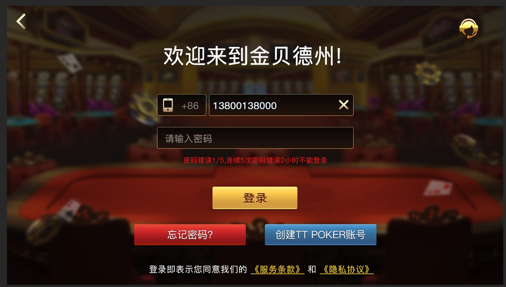

# 德州扑克源码｜金币大厅、多玩法与 Unity UI 资料

[简体中文](README.zh-CN.md) · [繁體中文](README.zh-TW.md) · [English](README.en.md) · [产品页面](https://niubideren111.github.io/Texas-Holdem-Game-Source-Code/zh-cn/)

以金币大厅和多玩法入口为主题的德州扑克项目资料，展示登录、SNG 选场和宝箱等界面。公开代码包含 Unity C# 与 Lua UI 适配器、签名工具和服务器异步回调片段。

**德州扑克源码 · 德州源码 · 德州金币大厅源码 · Unity扑克源码**

## 项目重点

### 大厅与玩法入口

通过登录、SNG 选场和活动截图展示移动端大厅的信息组织。

### Unity 与 Lua UI

LuaOSAListAdapter.cs、LuaOSATableAdapter.cs 和 LuaUIObject.cs 展示列表及 UI 适配。

### 服务回调与工具

external 中的登录及用户回调和 SignatureTool.cs 提供工程阅读入口。

## 资料阅读与核对方式

1. **先确认产品形态**：依次查看截图和图注，确认产品类型与可见功能流程。
2. **再核对文件证据**：直接打开下方列出的源码或文档，不只依赖功能描述。
3. **检查可构建范围**：确认准备运行的部分是否具备依赖、资源、配置和启动脚本。
4. **确认授权**：阅读仓库许可；商业素材及完整工程交付应另行取得书面授权。

## 产品截图




## 公开源码与资料

| 文件 | 说明 |
|---|---|
| [LuaOSAListAdapter.cs](LuaOSAListAdapter.cs) | Lua 列表适配器 |
| [LuaOSATableAdapter.cs](LuaOSATableAdapter.cs) | Lua 表格适配器 |
| [LuaUIObject.cs](LuaUIObject.cs) | Lua UI 对象桥接 |
| [SignatureTool.cs](SignatureTool.cs) | 签名工具类 |
| [external/AsyncLoginCallback.cpp](external/AsyncLoginCallback.cpp) | 服务端登录回调片段 |

## 开始阅读

```bash
git clone https://github.com/niubideren111/Texas-Holdem-Game-Source-Code.git
cd Texas-Holdem-Game-Source-Code
```

## 常见问题

### 本项目与私人局项目有何不同？

本页突出金币大厅、玩法选择和 Unity UI 代码；私人局项目侧重组局、俱乐部牌桌和场景资料。

### 从哪个文件了解客户端界面？

从 LuaUIObject.cs 入手，再阅读列表和表格适配器，了解 C# 与 Lua 界面的连接方式。

## 后续资料完善方向

补充登录到大厅的流程图、玩法入口截图、UI 适配器用法和 Unity 版本说明；独立列出 SNG/MTT 的实现范围。 后续更新还应加入版本化依赖清单、经过验证的构建或导入步骤、简明架构/产品流程图，以及能对应真实文件变化的版本记录。大型授权资源可放入 GitHub Releases 并提供校验值，不能提交密钥、生产地址或用户数据。

## 相关项目

- [Texas-Hold-em-source-code](https://github.com/niubideren111/Texas-Hold-em-source-code)
- [dezhou-poker-club-source-code](https://github.com/niubideren111/dezhou-poker-club-source-code)
- [Texas-Hold-em-Tournament-Source-Code](https://github.com/niubideren111/Texas-Hold-em-Tournament-Source-Code)

## 资料范围与许可

公开仓库提供 UI 适配代码、工具类、服务器回调片段及产品截图；完整客户端、服务端和数据配置通过项目联系方式沟通。 公开内容以实际文件、依赖和许可为准，不承诺搜索排名、直接上线或固定性能结果。

- Telegram: [@fox_lovemyself](https://t.me/fox_lovemyself)
- GitHub: [Texas-Holdem-Game-Source-Code](https://github.com/niubideren111/Texas-Holdem-Game-Source-Code)
